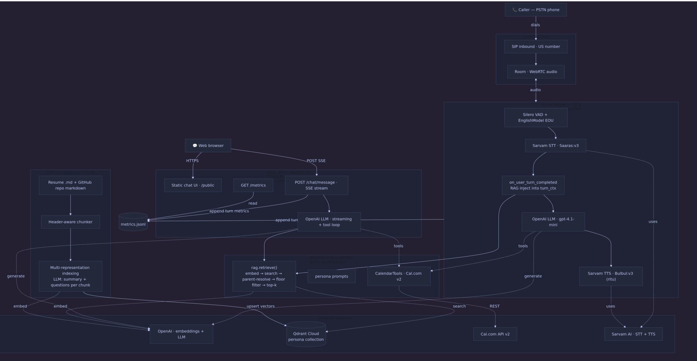

# Ayush Rathod — AI Persona (Phone + Chat)

An AI persona of Ayush Rathod you can **call on the phone** or **chat with on the web**. Both
surfaces share one RAG-grounded backend (real resume + real GitHub repos) and can **book a real
interview** on Cal.com with no human in the loop. Built on
[LiveKit Agents](https://docs.livekit.io/agents/), Sarvam AI (STT/TTS), OpenAI (LLM + embeddings),
and Qdrant Cloud.

> Built as the Scaler AI Engineer internship screening assignment (36-hour build). It is designed
> to stay always-on for a 7-day evaluation window — every component is production-grade, monitored
> from day one, and measured in a reproducible eval suite.

## Try it live

| Surface | Link |
|---|---|
| 📞 **Call the agent** | `+1 508 859 9063` |
| 💬 **Chat in the browser** | https://ayush-persona-api-23052201104.us-central1.run.app |

The chat page is the same backend that powers the phone agent — same retrieval, same persona,
same Cal.com booking.

## What it does

- **Voice agent** — answers an inbound phone call, speaks as Ayush's AI representative, answers
  grounded questions about his background, handles **barge-in/interruptions**, and books a meeting.
  First audio out in **~0.48s p50** (well under the 2s SLA).
- **Chat agent** — a public web UI streaming token-by-token over SSE, with the same RAG grounding
  and the same calendar tools.
- **Real RAG grounding** — answers come from Ayush's actual resume + 4 GitHub repos
  (Advista, ValueX, flick2code) indexed in Qdrant. No hardcoded answers; it says
  *"I don't have that detail"* rather than inventing one (**0% hallucination** across the eval set).
- **Real calendar booking** — live Cal.com **API v2** integration: reads real availability,
  proposes slots, collects contact info, and creates a confirmed booking.
- **Instrumented end to end** — per-stage latency + cost recorded per turn and surfaced at
  `GET /metrics`, feeding a reproducible eval report.

## Architecture



The two surfaces (voice worker, chat API) are separate processes but consume the **same** core
modules — `rag.retrieve()`, the persona prompts, and the Cal.com `CalendarTools` — so retrieval,
grounding, and booking are written once and used twice.

**Voice turn:** caller audio → LiveKit room → Silero VAD + semantic end-of-utterance →
Sarvam STT → `on_user_turn_completed` runs RAG and injects grounded facts into the *ephemeral*
`turn_ctx` (never the cached system prompt) → OpenAI LLM (with Cal.com tools) → Sarvam TTS streams
the first audio chunk back. RAG sits in the critical path, so it is prewarmed during the greeting.

**Chat turn:** browser → `POST /chat/message` → same `rag.retrieve()` → `build_chat_prompt` →
OpenAI streamed over SSE with the same Cal.com tool loop.

Both processes append per-turn latency/cost to `metrics.jsonl`, surfaced via `GET /metrics`.


## Tech stack

| Component | Choice | Why |
|---|---|---|
| Voice orchestration | LiveKit Agents (Python) | Native Sarvam plugins, barge-in, SIP telephony, no webhook hop |
| Pipeline | **Cascade** (STT → LLM → TTS) | Lets RAG context be injected as text + enables per-stage evals + reliable tool calls |
| VAD / turn-detection | Silero VAD + semantic EOU (`EnglishModel`) | Lets endpointing drop to 0.3s without cutting callers off |
| STT | Sarvam Saaras:v3 (WebSocket streaming) | Indian-English optimised, native plugin |
| LLM | OpenAI gpt-4.1-mini (→ gpt-4.1 for submission) | Fast TTFT, strong instruction-following; one env var to swap |
| TTS | Sarvam Bulbul:v3, `ritu` | TTFB ~0.21–0.48s, Indian-English voice, streams first chunk |
| Telephony | LiveKit US free number | Zero SIP config, international-callable |
| Backend | FastAPI (one app: chat + metrics + static UI) | Shared backend, not duplicated |
| Vector DB | Qdrant Cloud (us-east4) | Single dense collection, free tier |
| Embeddings | OpenAI `text-embedding-3-small` (1536d) | Cheap, fast on the hot path |
| Calendar | Cal.com **API v2** | v1 is decommissioned (HTTP 410) — see Decision 41 |
| Deploy | Worker → GCE (always-on) · API → Cloud Run (min-instances=1) | Worker is a persistent WebSocket; Cloud Run would scale it to zero |

## RAG pipeline

Retrieval is written once (`src/rag/retrieve.py`) and consumed by both surfaces; only the
*formatting* differs (`format_for_voice` strips markdown/code for clean TTS; `format_for_chat`
keeps it). Notable techniques (full rationale in [`decisions.md`](decisions.md)):

- **Multi-representation indexing** — at ingest, one LLM call per chunk generates a summary +
  2–3 questions the chunk answers; each is embedded as its own point. A question like *"what's your
  backend experience?"* matches a generated *"What backend systems did Ayush build?"* far better
  than the raw chunk. **Zero runtime cost** — all work happens at ingest. Retrieval resolves a
  representation hit back to the **parent chunk's full text** for grounding.
- **Over-fetch + dedup** — fetch `max(k×4, 20)` candidates, resolve to parents, dedup, then keep
  *k distinct* parents (multi-rep otherwise collapses k=6 to ~2 distinct chunks).
- **Per-chunk relevance floor (0.20, measured)** — keeps every chunk above the floor, drops the
  rest; flags `low_confidence` only when *nothing* clears it. Calibrated to how callers actually
  speak ("uh, where did *he* work?" scores ~0.29 vs 0.63 for the named form).
- **Ephemeral injection** — grounded facts are appended to LiveKit's per-turn `turn_ctx`, never the
  system prompt, so the cacheable prefix is never invalidated.
- **Fail-open** — retrieval is wrapped in a 3s timeout + catch-all; a backend blip answers
  un-grounded rather than dropping a turn (essential for 7 days of unannounced calls).
- **Greeting prewarm** — a tiny embed+search fires behind the greeting so the first real turn is
  warm (~1.9s cold → ~0.8s).

## Key engineering decisions

The full chronological log is in **[`decisions.md`](decisions.md)** (43 decisions). Highlights a
reviewer will care about:

- **Cascade over speech-to-speech** — the only way to inject retrieved text, measure per-stage
  quality, and call booking tools reliably. Accepted cost: full-turn E2E above 2s under grounded
  retrieval (first audio is still <2s).
- **The brief's Cal.com v1 is dead** — every v1 endpoint returns HTTP 410. Re-built on v2 (Bearer
  auth + per-endpoint `cal-api-version` pins), schema confirmed by a non-mutating 400 probe rather
  than a test booking.
- **Query rewriting tested and *rejected*** — it regressed follow-up accuracy (90%→80%) and added
  an LLM call to the voice path; conversation history already supplies the referent.
- **Specificity prompt nudge tested and *reverted*** — it made the model fabricate a statistic
  (groundedness 100%→95.8%). Lesson: for a grounded persona, **groundedness > completeness**.
- **Monitoring instrumented from day 1** — retrofitting produces skewed data; the eval report is
  built on metrics captured from the first call.

## Evaluation (Part C)

Full report: **[`src/eval/results/eval_report.pdf`](src/eval/results/eval_report.pdf)**
(Markdown: [`eval_report.md`](src/eval/results/eval_report.md)). Harness lives in `src/eval/`
(30-question golden set + LLM-as-judge + a regression gate). Reproduce with
`PYTHONPATH=src python -m eval.run_evals`.

**Chat groundedness (30 golden questions, gpt-4.1-mini judge)**

| Metric | Result |
|---|---|
| Hallucination rate | **0.0%** (0/30) |
| Out-of-corpus refusal | **100%** (4/4 declined) |
| Retrieval recall@6 | **1.0** |
| Retrieval precision@6 | 0.616 (highest on factual lookups, lowest on multi-source synthesis) |
| Answer correctness | 88.5% (misses are *incomplete*, never wrong) |

**Voice latency (~9 calls, 32 turns)**

| Metric | p50 | p95 |
|---|---|---|
| First audio out (TTS TTFB) — the brief's <2s figure | **0.478s** (100% <2s) | 1.033s |
| Full-turn E2E (user stops → agent speaks) | 4.572s | 8.143s |
| RAG retrieval (critical path) | 1.297s | — |
| Booking success | **70%** (7/10) | — |

**Three documented failure modes** (detail in the report):
1. **Cross-region RAG in the critical path** — E2E is dominated by retrieval (~1.3s) + the semantic
   end-of-turn wait, not synthesis. Fix: speculative retrieval during caller speech.
2. **Out-of-corpus "name-magnet"** — the resume contact chunk clears the floor for *any* query
   mentioning "Ayush"; the persona still refuses on content (100% end-to-end). Fix: cross-encoder
   reranker.
3. **Multi-source synthesis** — precision drops on questions that legitimately span files; all
   correctness misses were grounded-but-incomplete, **zero fabrications**. Fix: per-accomplishment
   resume chunking.

> Honest headline: the system meets **<2s on first response**, not on full perceived turn under
> RAG. Reporting those two numbers separately (rather than a blanket "<2s") is the point.

What I'd do with one more week: [`what_if_i_had_one_more_week.md`](what_if_i_had_one_more_week.md).

## Cost

**Per call (usage)** — roughly **$0.01–0.03 per ~3-min voice call** (~10 turns); chat is cheaper
(no STT/TTS). Component rates:

| Component | Rate |
|---|---|
| Sarvam STT (Saaras:v3) | ₹30/hr (~$0.32/hr) |
| Sarvam TTS (Bulbul:v3) | ₹30 / 10k chars |
| OpenAI gpt-4.1-mini | $0.40 / $1.60 per 1M in/out tokens |
| OpenAI embeddings (3-small) | $0.02 / 1M tokens (ingest is one-time, ~$0.0005 total) |

**Infrastructure (monthly, approximate)**

| Service | Cost |
|---|---|
| Voice worker — GCE always-on VM (e2-small; e2-micro OOMs on the model load) | ~$13 |
| Chat API — Cloud Run, min-instances=1 | ~$10–25 |
| Qdrant Cloud (free tier) · LiveKit (free number) | $0 |

Comfortably within GCP free credits for the 7-day evaluation window.

## Setup

**Prerequisites:** Python 3.12, Docker (for deployment), and accounts/keys for
LiveKit Cloud, Sarvam AI, OpenAI, Qdrant Cloud, and Cal.com.

### 1. Install

```bash
python -m venv .venv && source .venv/bin/activate
pip install -r requirements.txt
cp .env.example .env
```

### 2. Configure

Fill in `.env` (every var is annotated in `.env.example`). The essentials:

| Group | Vars |
|---|---|
| LiveKit | `LIVEKIT_URL`, `LIVEKIT_API_KEY`, `LIVEKIT_API_SECRET`, `AGENT_NAME` |
| Speech + LLM | `SARVAM_API_KEY`, `OPENAI_API_KEY` (models default in `config.py`) |
| RAG | `QDRANT_URL`, `QDRANT_API_KEY` (collection defaults to `persona`) |
| Calendar | `CALCOM_API_KEY`, `CALCOM_USERNAME`, `CALCOM_EVENT_SLUG` |

Config is centralized in `src/utils/config.py` (pydantic-settings) — changing a model or
voice is one env var, not a code edit.

### 3. Ingest the RAG corpus

The corpus (resume + GitHub repos) lives in `repos/`. Embed it and upsert into Qdrant:

```bash
PYTHONPATH=src python -m rag.ingest --reset      # --dry-run to count only, --no-multirep to skip representation gen
```

This runs the header-aware chunker + multi-representation indexing (LLM summary + questions
per chunk), then writes vectors to the `persona` collection. Run once per corpus change.

### 4. Run locally

```bash
# Chat API + static chat UI  →  http://localhost:8080
PYTHONPATH=src uvicorn api.main:app --reload --port 8080

# Voice worker (connects to LiveKit Cloud; hot-reloads in dev mode)
PYTHONPATH=src python src/agent/worker.py dev
```

To test the voice pipeline in your terminal without a phone, use `console` instead of `dev`.

### 5. Deploy (GCP)

Two processes, deployed separately:

| Service | Image | Target | Why |
|---|---|---|---|
| Voice worker | `Dockerfile.worker` | **GCE** (always-on) | persistent WebSocket to LiveKit — must not scale to zero |
| API + chat UI | `Dockerfile.api` | **Cloud Run** (`min-instances=1`) | public HTTPS URL, stays warm |

Images build locally and push to Artifact Registry; the API serves the chat UI (`public/`)
and `/chat`, `/metrics`, `/health` from one container. Full step-by-step (auth → APIs →
build/push → deploy → verify → redeploy/teardown)

## Repository layout

```
src/
├── agent/            # LiveKit voice worker
│   ├── worker.py     #   entrypoint (registers with LiveKit Cloud)
│   ├── pipeline.py   #   AgentSession: VAD→STT→LLM→TTS + RAG injection
│   ├── persona.py    #   system/chat prompt builders
│   ├── monitoring.py #   per-turn latency + cost metrics
│   └── tools/calendar.py   # Cal.com v2 booking tools
├── api/              # FastAPI — chat (SSE) + metrics + static UI
│   ├── main.py
│   └── routes/       # chat.py, metrics.py
├── rag/              # shared retrieval: ingest.py, store.py, retrieve.py
├── eval/             # golden sets, runners, report.py, results/
└── utils/config.py   # pydantic-settings — single source of truth
public/               # arch.png + index.html (chat UI)
repos/                # RAG corpus (resume + GitHub repos)
Dockerfile.api · Dockerfile.worker · deploy.md
```

## Further reading

- **[`decisions.md`](decisions.md)** — the full 43-decision engineering log (the "why" behind every choice).
- **[`src/eval/results/eval_report.pdf`](src/eval/results/eval_report.pdf)** — the 1-page eval report.
- **[`what_if_i_had_one_more_week.md`](what_if_i_had_one_more_week.md)** — researched-but-deferred RAG techniques, prioritised by what the evals actually flagged.
